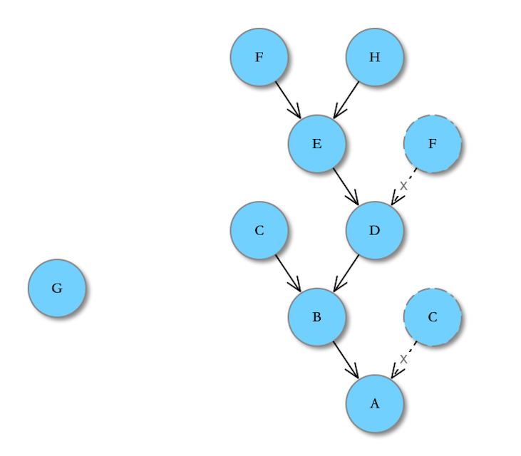
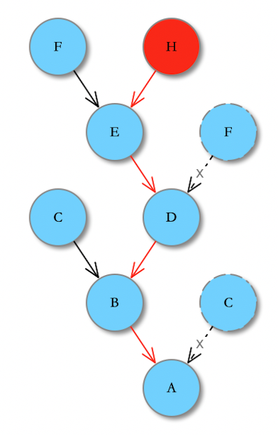

# ibit-exp4j

## 简介

`ibit-exp4j` 主要是计算类库 [exp4j](https://www.objecthunter.net/exp4j/) 进一步封装，进而简化公式计算的繁琐构造。exp4j 的用法可参考 wiki  [exp4j 用法](https://wiki.ibit.tech/d/340#r304)。

maven 依赖引入

```
<dependency>
    <groupId>tech.ibit</groupId>
    <artifactId>ibit-exp4j</artifactId>
    <version>1.0</version>
</dependency>
```

## 主要类

### 公式计算相关

* [FormulaEntity](https://ibit.tech/apidocs/ibit-exp4j/1.x/tech/ibit/exp4j/FormulaEntity.html)：定义公式实体

* [IVariable](https://ibit.tech/apidocs/ibit-exp4j/1.x/tech/ibit/exp4j/valuebean/IVariable.html)：定义公式变量

* [FormulaEvaluator](https://ibit.tech/apidocs/ibit-exp4j/1.x/tech/ibit/exp4j/FormulaEvaluator.html)：单个公式计算器

* [FormulaEvaluators](https://ibit.tech/apidocs/ibit-exp4j/1.x/tech/ibit/exp4j/FormulaEvaluators.html)：批量公式计算器

#### FormulaEntity

定义公式实体，其构造函数如下所示

```
/**
 * 构造函数
 *
 * @param formulaKey  公式键（等号左边）
 * @param formulaPart 公式部分（等号右边）
 */
public FormulaEntity(String formulaKey, String formulaPart);

/**
 * 构造函数
 *
 * @param variablePrefix 变量前缀（标识变量）
 * @param formulaKey     公式键（等号左边）
 * @param formulaPart    公式部分（等号右边）
 */
public FormulaEntity(String variablePrefix, String formulaKey, String formulaPart);
```

**说明：**

* 定义公式：`公式键`=`公式部分`，如：`#a=#b+100`，公式键为：`#a`，公式部分为：`#b+100`；
* 如果没指定变量前缀，默认用`#`作为变量标识，如：`#a=#b+100`，则 `a` 和 `b` 为变量；
* 可指定自定义变量前缀，如`@`，则公式可定义为 `@a=@b+100`。

#### IVariable

IVariable 接口定义了变量的值设置/获取，计算错误设置/获取，计算精度获取。

具体实现有 [ResultMapBean](https://ibit.tech/apidocs/ibit-exp4j/1.x/tech/ibit/exp4j/valuebean/impl/ResultMapBean.html) 和 [ObjectBean](https://ibit.tech/apidocs/ibit-exp4j/1.x/tech/ibit/exp4j/valuebean/impl/ObjectBean.html)。

#### FormulaEvaluator

定义单个公式计算，其构造函数如下所示：

```
/**
 * 构造函数
 *
 * @param formulaKey  公式键（等号左边）
 * @param formulaPart 公式部分（等号右边）
 */
public FormulaEvaluator(String formulaKey, String formulaPart);

/**
 * 构造函数
 *
 * @param variablePrefix 变量前缀（标识变量）
 * @param formulaKey     公式键（等号左边）
 * @param formulaPart    公式部分（等号右边）
 */
public FormulaEvaluator(String variablePrefix, String formulaKey, String formulaPart);

/**
 * 构造函数
 *
 * @param formulaKey  公式键（等号左边）
 * @param formulaPart 公式部分（等号右边）
 * @param operators   自定义符号列表
 * @param functions   自定义函数列表
 */
public FormulaEvaluator(String formulaKey, String formulaPart
    , List<Operator> operators, List<Function> functions);

/**
 * 构造函数
 *
 * @param variablePrefix 变量前缀（标识变量）
 * @param formulaKey     公式键（等号左边）
 * @param formulaPart    公式部分（等号右边）
 * @param operators      自定义符号列表
 * @param functions      自定义函数列表
 */
public FormulaEvaluator(String variablePrefix, String formulaKey, String formulaPart
    , List<Operator> operators, List<Function> functions);
```

说明：

* 参数 `variablePrefix`、`formulaKey` 和 `formulaPart` 跟公式实体定义相关；
* 参数 `operators` 为自定义符号，exp4j 支持自定义符号，如 `$`，`>`，`==` 等；
* 参数 `functions` 为自定义方法，exp4j 支持自定义函数，如 `min`，`max` 等。

公式计算方法：

```
/**
 * 计算
 *
 * @param iVariable 计算变量值
 * @return 计算结果
 */
public Double evaluate(IVariable iVariable);
```

说明：

* iVariable 为计算变量值；
* 若 formulaKey 以 `!` 开头，则为强制计算，公式部分中的变量如果有null值，则使用默认值替换；
* 若 formulaKey 以 `N!` 开头，公式中任意变量为 null，则返回 null；
* 若 formulaKey 不以 `!` 或 `N!` 开头，公式中全部变量为 null，则返回 null。


示例 demo 如下，更多示例参考：[FormulaEvaluatorTest](https://github.com/ibit-tech/ibit-exp4j/blob/main/src/test/java/tech/ibit/exp4j/FormulaEvaluatorTest.java)

```
@Test
public void evaluate9() {
    IVariable variable = ResultMapBean.getInstance(4, 2, BigDecimal.ZERO);
    variable.setValue("a", BigDecimal.TEN);
    variable.setValue("b", BigDecimal.ONE);


    FormulaEvaluator evaluator = new FormulaEvaluator("#", "#c", "min(#a, #b$)"
            , OperatorEnhanceUtils.getOperators(), MathFunctionEnhanceUtils.getFunctions());

    assertEquals(BigDecimal.ONE.doubleValue(), evaluator.evaluate(variable), 0);

    evaluator = new FormulaEvaluator("#", "#c", "abs(#b)"
            , OperatorEnhanceUtils.getOperators(), MathFunctionEnhanceUtils.getFunctions());

    assertEquals(BigDecimal.ONE.doubleValue(), evaluator.evaluate(variable), 0);
}
```

#### FormulaEvaluators 

定义批量公式计算，其构造函数如下：

```
/**
 * 构造函数
 *
 * @param variablePrefix    变量前缀
 * @param formulaProperties 公式配置（公式键:公式部分）
 */
public FormulaEvaluators(String variablePrefix, Map<String, String> formulaProperties);

/**
 * 构造函数
 *
 * @param variablePrefix    变量前缀
 * @param formulaProperties 公式配置（公式键:公式部分）
 * @param operators         自定义操作符
 * @param functions         自定义操作符
 */
public FormulaEvaluators(String variablePrefix, Map<String, String> formulaProperties
        , List<Operator> operators, List<Function> functions);
```

说明：

* 参数 `variablePrefix` 和 `formulaProperties` 跟公式实体定义相关；
* 参数 `operators` 为自定义符号，exp4j 支持自定义符号，如 `$`，`>`，`==` 等；
* 参数 `functions` 为自定义方法，exp4j 支持自定义函数，如 `min`，`max` 等。

公式计算方法:

```
/**
 * 对每一行记录进行处理，包括如下步骤
 * a)公式解析
 * b)变量赋值
 * c)计算
 * d)存储计算结果
 *
 * @param variable 变量
 */
public void evaluateAll(IVariable variable);
```

* iVariable 为计算变量值；
* 若 formulaKey 以 `!` 开头，则为强制计算，公式部分中的变量如果有null值，则使用默认值替换；
* 若 formulaKey 以 `N!` 开头，公式中任意变量为 null，则返回 null；
* 若 formulaKey 不以 `!` 或 `N!` 开头，公式中全部变量为 null，则返回 null。

### 自定义函数和操作符扩展工具类

* [MathFunctionEnhanceUtils](https://ibit.tech/apidocs/ibit-exp4j/1.x/tech/ibit/exp4j/utils/MathFunctionEnhanceUtils.html)：数学函数扩展（rint,pow,min,max）

* [OperatorEnhanceUtils](https://ibit.tech/apidocs/ibit-exp4j/1.x/tech/ibit/exp4j/utils/OperatorEnhanceUtils.html)：操作符扩展（$,//,>,>=,==,<=,<）

#### MathFunctionEnhanceUtils

exp4j 默认支持函数，查看 [exp4j wiki](https://wiki.ibit.tech/d/340#r304)。MathFunctionEnhanceUtils 扩展了 `rint`， `pow`， `min`，`max`，公式计算按需加载即可。

#### OperatorEnhanceUtils

OperatorEnhanceUtils 扩展了 exp4j 操作符，按需加载即可，扩展操作符说明如下：

| 操作符 | 说明 |
| --- | --- |
| $ | 如果分母为0，则抛 `ArithmeticException`</br>如：a/b$，b 为 0 时，抛 `ArithmeticException `|
| // | 如果分母为 0，则结果返回 0 |
| > | a>b，若满足 `a>b`，返回 1，否则返回 0|
| >= | a>=b，若满足 `a>=b`，返回 1，否则返回 0|
| < | a>=b，若满足 `a<b`，返回 1，否则返回 0|
| <= | a>=b，若满足 `a<=b`，返回 1，否则返回 0|
| == | a>=b，若满足 `a==b`，返回 1，否则返回 0|


### 关系相关

定义关系，当某个变量值发生变化的时候，计算出受影响的节点，进行重新计算。

* [RelationEntity](https://ibit.tech/apidocs/ibit-exp4j/1.x/tech/ibit/exp4j/RelationEntity.html)：关系实体

* [EffectedRelation](https://ibit.tech/apidocs/ibit-exp4j/1.x/tech/ibit/exp4j/EffectedRelation.html)：影响关系

* [RelationEvaluators](https://ibit.tech/apidocs/ibit-exp4j/1.x/tech/ibit/exp4j/RelationEvaluators.html)：关系计算器

#### RelationEntity

定义关系实体。为树节点，可以获取到该节点影响节点。子节点为受影响的节点

#### EffectedRelation

定义节点与节点之间的影响关系，1对1。

#### RelationEvaluators 

定义关系计算器，其构造函数如下所示：

```
/**
 * 构造函数
 *
 * @param formulaEntities 公式实体
 */
public RelationEvaluators(FormulaEntity... formulaEntities);

/**
 * 构造函数
 *
 * @param effectedRelations 关系对
 */
public RelationEvaluators(EffectedRelation... effectedRelations);
```

说明：

* 构造函数1：指定公式数组
* 构造函数2：指定影响关系

主要方法：

```
/**
 * 获取受影响的节点名称
 *
 * @param nodeName 节点名称
 * @return 受影响的节点名称列表
 */
public Set<String> getEffectedNodeNames(String nodeName);
```

说明：

* 查找某个节点所影响的节点结合（遍历树：深度遍历）

示例说明：

假设定义了如下公式（`#`为变量标识）：

```
#A=#B/#C
#B=#C-#D
#D=#E+#F
#E=#F+#H
#G=1+2
```

构造出如下关系树（箭头指向影响节点）：



获取节点（H）所影响节点，如下所示：



红色箭头代表影响的节点流转。上图可以看出，节点 H 影响的节点有 E、D、B、A。

批量计算公式时，某个值改变（如 H），只需要重算其影响的节点（E、D、B、A），而不是所有重算。

